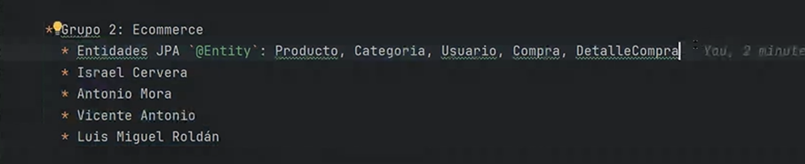

# Proyecto Final Curso Grupo 2

## Ecommerce

El proyecto será crear plataforma o web Ecommerce de productos.

## Componentes del grupo

# Descripción proyecto

Esta es la explicación en detalle del proyecto Ecommerce (en adelante Shop)

## Entidades para Shop

* USUARIO
  * id (PK)
  * nombre_usuario
  * password
  * email
  * direccion

* CATEGORIA
  * id (PK)
  * nombre
  * descripcion

* PRODUCTO (Relacion ManyToOne)
  * id (PK)
  * nombre
  * descripcion
  * precio
  * stock
  * image_url (preguntar a Maria)
  * categoria_id (FK)

* COMPRA
  * id (PK)
  * fecha_compra
  * total
  * usuario_id (FK)

* DETALLE_COMPRA
  * id (PK)
  * cantidad
  * precio_unitario
  * dto_compra (duda)
  * compra_id (FK)
  * producto_id (FK)

## CONTROLLERS

## HTML

  * index.html
  * productos.html
  * categorias.html
  * compra.html
  * detalle_compra.html

## Desglose del trabajo

  * Entities
    * Antonio

  * Repositorys
    * Luis Miguel (buscar datos)

  * Controller
    * Entre todos

  * Html
    * Yo

PASOS A SEGUIR

    Crear un repositorio de GitHub por grupo
    Crear entidades y atributos
    Repositorios
    Controladores
    HTMLs: list, detalle, formulario
    Asociaciones ManyToOne entre entidades (parte más propensa a problemas)
    Estilización CSS con Bootstrap CSS
    Crear logo con canva o un generator de logos

Plantear dividir estas tareas según metodología ágil en una herramienta de gestión de proyectos.

Repositorio:

    Lo crea un usuario del grupo: github.com/user1/grupo1_proyecto_java (público)
    El admin invita como colaboradores a su equipo
    El resto lo clona
    Opción 1: hacer pull y commit y push todos los días/semanas a la rama main
    Opción 2: cada usuario crea una rama para sus desarrollos
    Opción 3: fork

Recomendación: Opción 1 y eventualmente opción 2.

Consejo: todos los días hacer pull y si nuestros cambios están bien hacer un commit y push

Requisitos:

    Cada uno es responsable de hacer pull commit y push de su código funcional
    Actualizar el progreso de las tareas en la herramienta de gestión de proyectos (Trello o Jira o Notion o GitHub Issues)

PRESENTACIÓN PROYECTOS

26/06/2025 ensayo con mentores

02/07/2025 presentación a empresas

Cada grupo presenta el proyecto en 15 minutos.

    Nombre y logo del proyecto
    Introducción y objetivos y problema que resuelve
    Equipo: presentarse cada uno brevemente pero dando una pincelada de la experiencia o cursos anteriores.
    Tecnologías empleadas: Java 24, IntelliJ IDEA, Spring Boot, HTML, Bootstrap CSS, Thymeleaf, H2 o MySQL, Git y GitHub, Reuniones diarias o semanales, gestión de proyectos con Trello-Jira-Notion
    Mostrar el repositorio de GitHub, no hace falta explicar el código
    Diseños Figma (opcional)
    Demo:
        Home
        Listado de Algo (Productos, Tareas, Proyectos, Libros...)
        Detalle de Algo (Producto, Tarea, Libro...)
        Formulario de Algo (formulario para crear un producto)
        Login y Registro
    Conclusiones e ideas futuras
        Trabajar en equipo de forma colaborativa
        Aprender Java, Spring Boot, crear aplicación full stack web desde cero
        Aprender a crear modelos de datos esquemas de base de datos
        Ideas futuras: capa seguridad, distintos roles de usuario, agregar X funcionalidades, dashboard de compras realizadas
